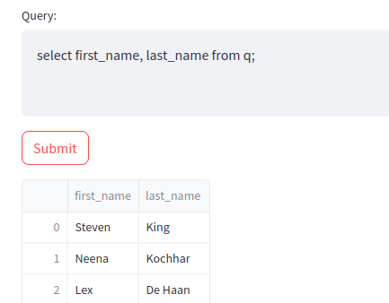

# PandaQ

Aquesta pàgina descriu la pràctica de GEI-LP (edició 2023-2024 Q1). La vostra feina consisteix en implementar un petit intèrpret anomenat PandaQ amb les característiques principals següents:

- Entrada: subconjunt de consultes SQL 

- Dades: arxius en format csv 

- Tractament: llibreria pandas 

- Interfície: Streamlit 

## Tasca 1: integració bàsica

L'objectiu d'aquesta primera tasca és la integració dels components bàsics que formaran part de l'intèrpret. Per tal de realitzar la pràctica partim d'una base de dades petita extreta del tutorial:

- [https://www.sqltutorial.org/](https://www.sqltutorial.org/)

La figura següenta mostra el seu esquema:


Podeu descarregar [aquí](data.zip) un arxiu que conté les diferents taules en format csv. 

En aquesta primera tasca heu generar una primera gramàtica que reconegui la lectura de taules senceres:

```sql
select * from taula;
```

A més, genereu el visitor corresponent i el conecteu a la llibreria [streamlit](https://streamlit.io).

#### Exemple:


## Tasca 2a: camps

Afegiu la possibilitat de seleccionar les columnes (camps) que voleu veure:

```sql
select camp1, camp2... from taula;
```

#### Exemple:


## Tasca 2b: camps calculats

Afegiu la funcionalitat de tenir camps calculats amb operacions aritmètiques bàsiques: $+,-,\times,/,()$. Afegiu-li en nom del camp per a que surti com a nom de columna en mostrar els resultats.

```sql
select camp_no_calculat, camp_calculat as id from taula;
```

#### Exemple:


## Tasca 3: order by

Afegiu la funcionalitat de mostrar les dades ordenades:

```sql
select camps from taula order by camp1 [asc|desc], camp2 [asc|desc];
```

#### Exemple:


## Tasca 4: where

Afegiu la possibilitat d'aplicar filtres amb operacions relacionals i booleanes bàsiques: $<,=,and,not,()$. No cal que implementeu les operacions aritmètiques.

```sql
select camps from taula where condició;
```

#### Exemple:


## Tasca 5: inner join

Afegiu la possibilitat de fer un subconjunt dels *inner joins* (el camp esquerre de la igualtat correspon a la primera taula i el de la dreta a la segona):

```sql
select camps from taula1
inner join taula2 on 
      camp_taula_1 = camp_taula_2;
```

Els *inner joins* es poden en cadenar.

#### Exemple 1:


## Exemple 2:


## Tasca 6: taula de símbols

Afegiu la possibilitat de guardar el resultat de consultes a una taula de símbols. En aquest cas haureu d'utilitzar el mecanisme *state* de l'streamlit.

```sql
id := consulta;
select * from id;
```

#### Exemple:




## Tasca 7: plots

Afegiu la possibilitat de fer gràfiques de linies de les dades numèriques d'una de les consultes guardades a la taula de símbols.

```sql
plot id ;
```


## Tasca 8: subqueries

Afegiu la possibilitat de fer subconsultes.

```sql
select camps from taula where camp in (consulta);
```

#### Exemple:


## Llibreries

Utilitzeu `ANTLR` per escriure la gramàtica i l'intèrpret, el `pandas`pel tractament de dades i `streamlit`per a la interfície gràfica. Podeu utilitzar lliurament qualsevol llibreria estàndard de Python.

Per cridar a l'script mitjançant l'streamlit haureu de fer des de la consola:

```
streamlit run pandaQ.py
```

# Consells

Per tal de fer la  pràctica, us recomanem de seguir aquests passos:

1. Feu tots els exercicis de laboratori inclosos a https://gebakx.github.io/Python3/compiladors.html#1. Us serà molt útil, de debò.

2. Seguiu l'ordre de les tasques tal i com estan a l'enunciat.

3. En desenvolupar cada tasca, aneu provant que us funcionin els jocs de proves anteriors.

4. Escriviu el README.

5. Si voleu, realitzeu extensions.

Al llarg de tots els passos anteriors, aneu documentant tot allò que no sigui obvi.

Deixeu la feina bruta a l'ANTLR: si feu una bona gramàtica, cadascun dels vostres visitadors serà molt curt i molt senzill. Si els vostres visitadors tenen molta lògica, retoqueu la gramàtica, introduint noves regles i/o etiquetes.

Feu la pràctica "amb carinyo".

# Lliurament

Heu de lliurar la vostra pràctica al Racó. Només heu de lliurar un fitxer ZIP
que, al descomprimir-se generi:

- Un fitxer `README.md` que documenti el vostre projecte.
  |:- vegeu, per exemple, https://www.makeareadme.com/.

- Un fitxer `pandaQ.g4` amb la gramàtica del LP.

- Un fitxer `pandaQ.py` amb el programa de l'intèrpret, incloent els seus visitadors.

- Res més. De debò, res més. Tampoc directoris. Ni subdirectoris. Ni `.git`s, ni `.MACOS_XXX`... Res més, collons!

Els vostres fitxers de codi en Python han de seguir les regles d'estil PEP8, tot i que podeu oblidar les restriccions sobre la llargada màxima de les lı́nies. Podeu utilitzar els paquets `pep8` o `autopep8` o http://pep8online.com/ per assegurar-vos que seguiu aquestes regles d'estil. L’ús de tabuladors en el codi queda prohibit (zero directe). Els vostres programes en AChurch han de seguir l'estil exposat en aquest document.

El termini de lliurament és el **dilluns 15 de gener a les 8:00**.

Per evitar problemes de còpies, no pengeu el vostre projecte en repositoris públics.

# Referències

- ANTLR en Python: https://gebakx.github.io/Python3/compiladors.html#1

- Pandas Documentation:[https://pandas.pydata.org/pandas-docs/stable/index.html](https://pandas.pydata.org/pandas-docs/stable/index.html)

- Streamlit Documentation: [https://docs.streamlit.io/](https://docs.streamlit.io/)

- Tutorial SQL: [https://www.sqltutorial.org/](https://www.sqltutorial.org/)
